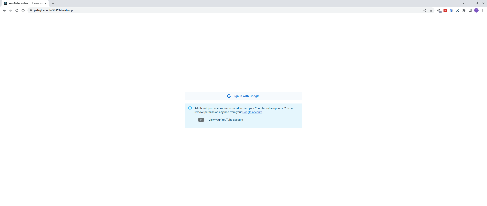
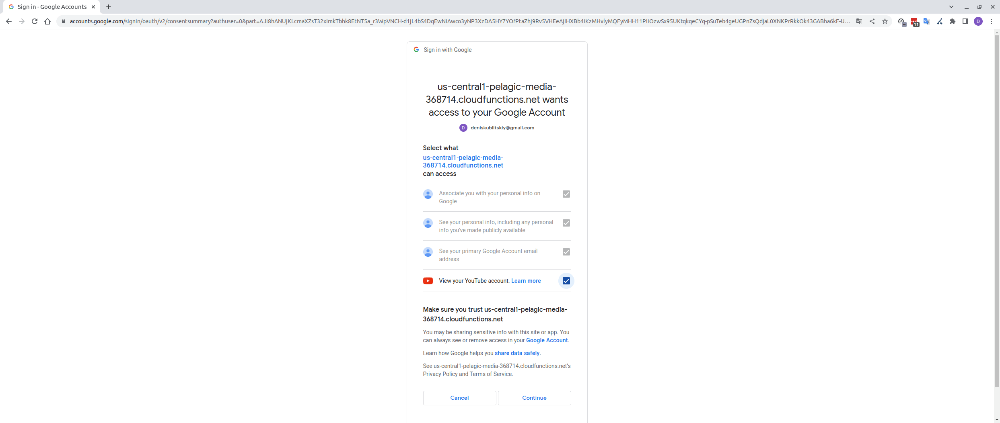
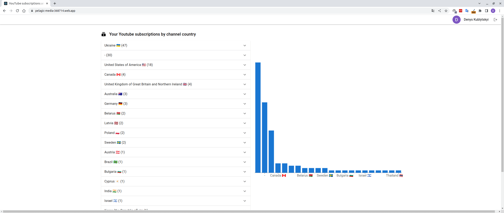
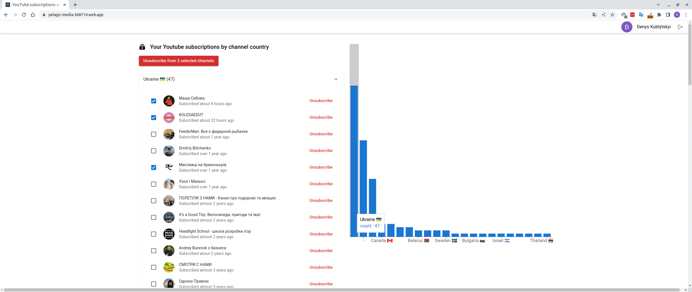
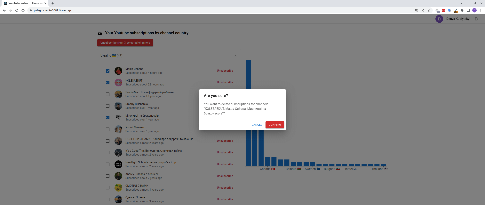
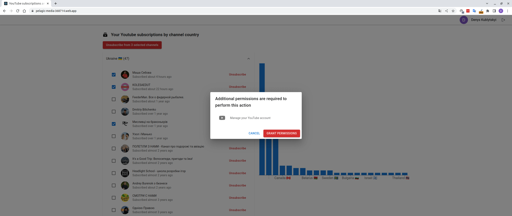

# youtube-subscriptions-analyzer

This is a tool to analyze your YouTube subscriptions. It lists your channel's subscriptions and groups them by country, and allows quick multiple unsubscribes that are impossible with the YouTube interface. 

[Demo](https://pelagic-media-368714.web.app/)

1. Sign Up page

2. Google OAuth2 scopes grant dialog

3. Subscriptions page

4. Subscriptions page with multiple subscriptions select for removal

5. Multiple subscriptions removal

6. Incremental scope grant

